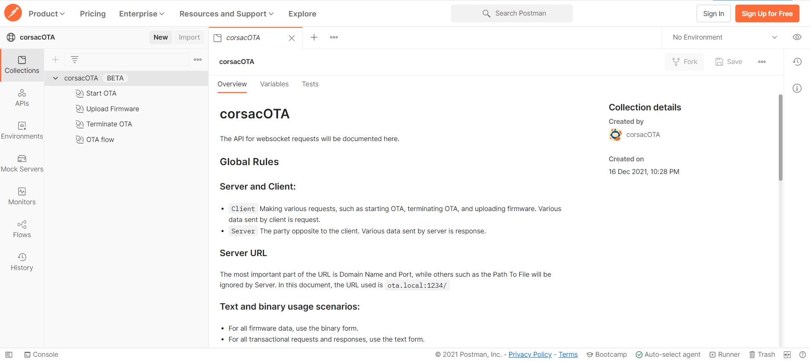

<p align="center">
    
</p>

<h1 align="center">corsacOTA</h1>

<div align="center">

An esp8266/esp32 websocket OTA library.

[![deploy status][github-action-deploy-image]][github-action-deploy-url] [![test status][github-action-test-image]][github-action-test-url] [![license][license-image]][license-url]

[github-action-deploy-image]: https://github.com/windowsair/corsacOTA/actions/workflows/surge-deploy.yml/badge.svg
[github-action-deploy-url]: https://github.com/windowsair/corsacOTA/actions/workflows/surge-deploy.yml

[github-action-test-image]: https://github.com/windowsair/corsacOTA/actions/workflows/test.yml/badge.svg
[github-action-test-url]: https://github.com/windowsair/corsacOTA/actions/workflows/test.yml

[license-image]: https://img.shields.io/badge/license-MIT-green.svg
[license-url]: https://github.com/windowsair/corsacOTA/LICENSE

**Warning: This project is not yet ready for production, API and document are subject to change without notice.**

</div>

## Features

- ⚙️ Fine-granular OTA management.
- 📦 A frontend component out of the box.
- 🔨 Easy to integrate into user projects.
- ✂️ No need to embed the frontend page, lower firmware and memory usage.
- 🚀 Lightweight and fast WebSocket implementation.

Support device

- [x] esp8266/esp8285
- [x] esp32
- [x] esp32c3
- [x] esp32s3

## Use the web client for OTA

[🌐 Demo Site](http://corsacOTA.surge.sh)

https://user-images.githubusercontent.com/17078589/146638094-34c46717-1b1a-42a6-961f-4835347cc6e5.mp4


## Usage

corsacOTA works with esp-idf.

Just add [src/corsacOTA.c](src/corsacOTA.c) to your project:
```c
co_handle_t handle;
co_config_t config = {
    .thread_name = "corsacOTA",
    .stack_size = 4096,
    .thread_prio = 8,
    .listen_port = 3241,
    .max_listen_num = 4,
    .wait_timeout_sec = 60,
    .wait_timeout_usec = 0,
};

corsacOTA_init(&handle, &config);
```

Related examples of use can be found here: [examples](./examples)

## Document

### API for frontend

corsacOTA provides a default frontend for performing online OTA, and you can also implement it yourself. See: [corsacOTA API on postman](https://www.postman.com/corsacOTA/workspace/corsacota/collection/61bb4cf5bdc5c3127b44f99c?uac=y)



### Parition table
Currently supported OTA partition table modes: Factory app, two OTA definitions.

### Motivation and Notes

Ease of use, minimal dependencies, and fine-grained OTA management were the starting points for this project.

----

**Why do we use websockets in our projects?**

In the world of browser, the use of websockets is somewhere between pure sockets and HTTP. Considering that most of the usage scenarios are in the browser, we have chosen websocket.

However, WebSocket is not always a good idea because operations such as handshake and mask add a certain level of complexity. If the network is good, then other solutions should achieve the same results.

Nevertheless, it has some advantages in complex network conditions with frequent packet loss, where you can achieve easy flow control and more precise progress control in the browser.

Overall, our solution is a compromise between ease of use, compatibility and speed.

## Dependency

For the main part of the project, there are no dependencies on third-party libraries other than esp-idf.

For frontend:

- [Vue3](https://github.com/vuejs/vue-next)
- [Tailwind CSS](https://github.com/tailwindlabs/tailwindcss)

## Credit

Credits to the following project, people and organizations:

- [@HeavenSpree](https://www.github.com/HeavenSpree)
- [@Vizards](https://www.github.com/Vizards)